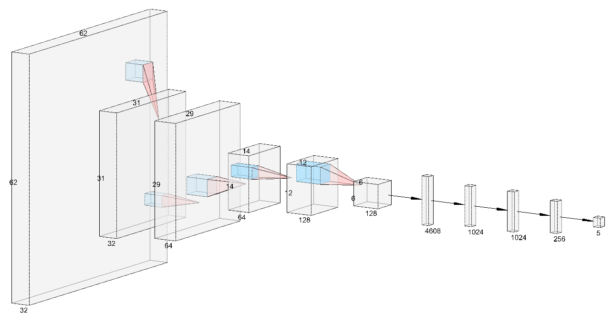
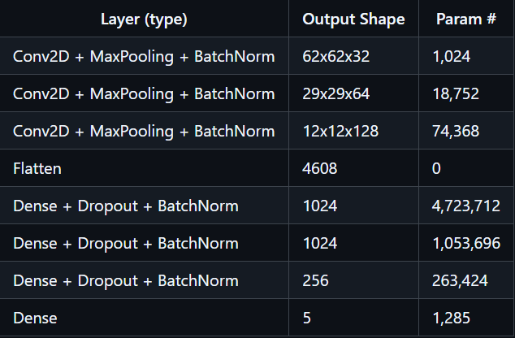
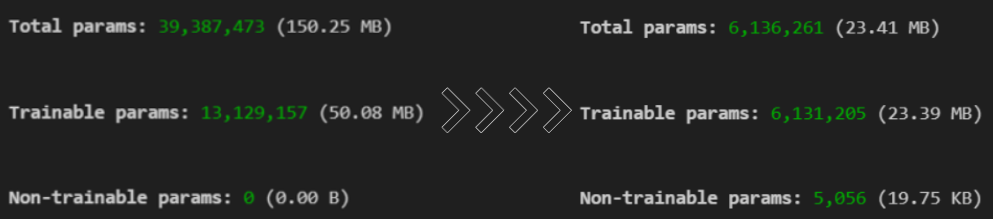

# Terrain-Recognition

### Overview

This project utilizes a Convolutional Neural Network (CNN) to classify terrain types from input images with high precision. The model, trained on 10,000 images across five terrain classes, achieves a validation accuracy of 84.62%, showcasing its strong ability to generalize and accurately distinguish between different terrains.

There is additional a model that achieves **91.93% validation accuracy** and **92.40% test accuracy** with a size of approximately **15.6 MB**, for more details see the [EfficientNet-B0 Model README](transfer_learning/ReadMe.md).

  

## Dataset

We curated a custom dataset by scraping over 10,000 images from the internet across five terrain categories—Coast, Desert, Forest, Glacier, and Mountain—using Python libraries like BeautifulSoup and Selenium. The dataset was meticulously organized into 10,000 training images and 500 test images to ensure diverse coverage for training and robust evaluation.

  

## Model Architecture

<table>
  <tr>
    <td style="vertical-align: top;">
      <h3>Total Parameters</h3>
      <ul>
        <li>6,136,261 (23.41 MB)</li>
        <li>Trainable params: 6,131,205 (23.39 MB)</li>
        <li>Non-trainable params: 5,056 (19.75 KB)</li>
      </ul>
      
<strong>Note:</strong> The <code>None</code> in the output shape indicates the batch size is flexible and can vary during training or inference.

    </td>
    <td style="text-align: right;">
      
    </td>
  </tr>
</table>

## Results

Our model achieved an impressive overall accuracy of 84.62% on the test dataset. This success reflects the effectiveness of our carefully designed architecture, which was developed through extensive experimentation and fine-tuning. The high performance underscores the model's strong ability to recognize and classify various terrains.

  

## Optimization

Through multiple iterations and architectural experimentation, we successfully optimized our model to be significantly more lightweight, reducing its size from **`150 MB`** to just **`23 MB`**. This optimization was crucial for deploying the model in mobile and edge environments where resource efficiency is key.

  

This reduction in size makes the model highly suitable for real-world mobile applications without compromising on accuracy, demonstrating the power of a well-optimized architectural design.

## Acknowledgments

This project was developed by Team "LearnX" as part of SIH: Deep learning for terrain recognition.

### LearnX LEAD : S AKASH

  
Click to see the list of contributors

  
  - Vihaan Agrawal

- Ruchi Chand Thakur

- Manas Gupta

- Tanmay Singh

- Harshith Patnaik

  </tr>
</table>
