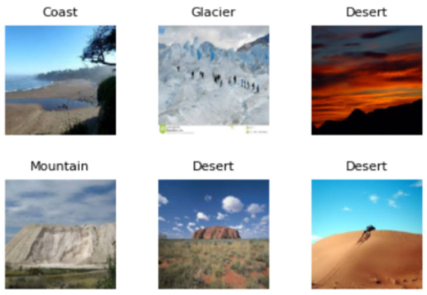

# Terrain-Recognition

### Overview
This project utilizes a Convolutional Neural Network (CNN) to classify terrain types from input images with high precision. The model, trained on 10,000 images across five terrain classes, achieves a validation accuracy of 84.62%, showcasing its strong ability to generalize and accurately distinguish between different terrains.

  

#### Drive for train, test data, and pre-trained model :
https://drive.google.com/drive/folders/1hbL1m39TF8ABe0oCj5XYDbHXY-gPIjcQ?usp=sharing

### Dataset

We curated a custom dataset by scraping over 10,000 images from the internet across five terrain categories—Coast, Desert, Forest, Glacier, and Mountain—using Python libraries like BeautifulSoup and Selenium. The dataset was meticulously organized into 10,000 training images and 500 test images to ensure diverse coverage for training and robust evaluation.

  

  

#### Results

The trained model achieved an accuracy of 74% on the test dataset, demonstrating its ability to recognize different terrains. Here are some sample predictions:

  Coast: 80% accuracy

  Desert: 70% accuracy

  Forest: 85% accuracy

  Glacier: 65% accuracy

  Mountain: 78% accuracy

The model's performance can be further improved with additional data and fine-tuning.

#### Usage

 To use the trained model for terrain recognition, follow these steps:

 Install the required dependencies (see Dependencies).

 Load the pre-trained model using a Python script.

 Provide an image to the script, and it will predict the terrain type.

 For detailed usage instructions, refer to the project's source code and documentation.

It is recommended to do this in google collab as access to images,files and models are easier as such.

#### Dependencies

 Python 3.x

 TensorFlow (deep learning framework)

 Jupyter Notebook (for running and experimenting with the code) or use google collab

 Numpy (for data manipulation)

You can install the required Python packages using pip:

"pip install tensorflow numpy  jupyter"

### Acknowledgments

This project was developed by Team "LearnX" as part of SIH: Deep learning for terrain recognition.

#### TEAM: LearnX

TEAM LEAD: S AKASH

MEMBER 1:Vihaan Agrawal

MEMBER 2:Ruchi Chand Thakur

MEMBER 3:Manas Gupta

MEMBER 4:Tanmay Singh

MEMBER 5:Harshith Patnaik
