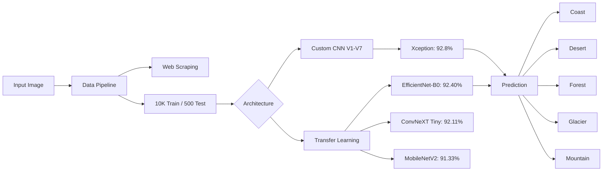
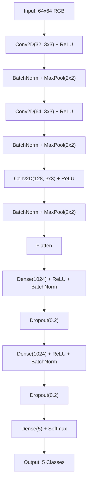
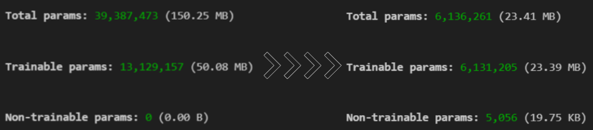
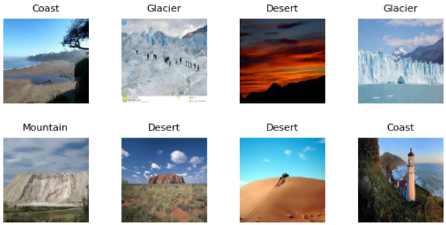
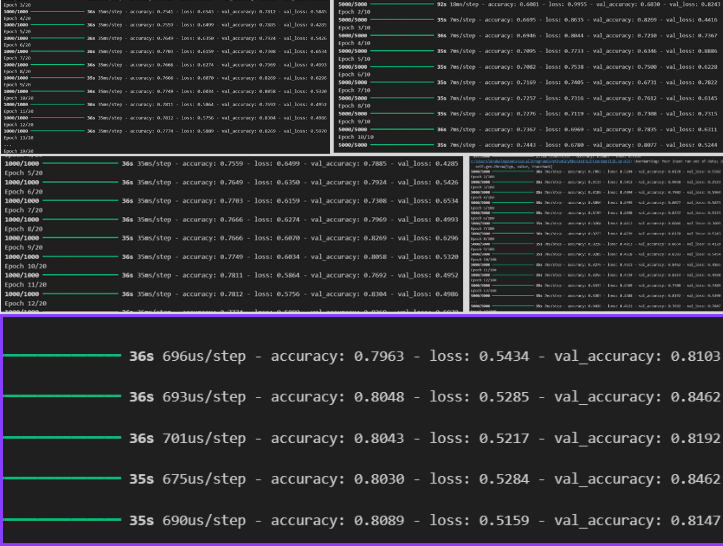

# Terrain Recognition

CNN-based terrain classification from satellite and ground-level imagery, achieving **92.40% test accuracy** with EfficientNet-B0 transfer learning across five terrain classes.

<p align="center">
  
</p>

## Overview

Developed for **SIH (Smart India Hackathon)** under the problem statement "Deep Learning for Terrain Recognition," this project iterates through seven custom CNN architectures and multiple transfer learning approaches. The model was progressively optimized from **150 MB down to 15.6 MB** while improving accuracy, making it deployable on mobile and edge devices.


```mermaid
graph LR
    A[Input Image] --> B[Data Pipeline]
    B --> B1[Web Scraping]
    B --> B2[10K Train / 500 Test]

    B2 --> C{Architecture}
    C --> D[Custom CNN V1-V7]
    C --> E[Transfer Learning]

    D --> D1[Xception: 92.8%]
    E --> E1[EfficientNet-B0: 92.40%]
    E --> E2[ConvNeXT Tiny: 92.11%]
    E --> E3[MobileNetV2: 91.33%]

    D1 & E1 --> F[Prediction]
    F --> G1[Coast]
    F --> G2[Desert]
    F --> G3[Forest]
    F --> G4[Glacier]
    F --> G5[Mountain]
```

## Model Architecture

The custom CNN architecture used across V1-V7 experiments:


```mermaid
graph TD
    A["Input: 64x64 RGB"] --> B["Conv2D(32, 3x3) + ReLU"]
    B --> B1["BatchNorm + MaxPool(2x2)"]
    B1 --> C["Conv2D(64, 3x3) + ReLU"]
    C --> C1["BatchNorm + MaxPool(2x2)"]
    C1 --> D["Conv2D(128, 3x3) + ReLU"]
    D --> D1["BatchNorm + MaxPool(2x2)"]
    D1 --> E["Flatten"]
    E --> F["Dense(1024) + ReLU + BatchNorm"]
    F --> F1["Dropout(0.2)"]
    F1 --> G["Dense(1024) + ReLU + BatchNorm"]
    G --> G1["Dropout(0.2)"]
    G1 --> H["Dense(5) + Softmax"]
    H --> I["Output: 5 Classes"]
```

## Results

### Complete Model Comparison

| Model | Architecture | Test Accuracy | Model Size | Framework |
|:------|:------------|:------------:|:----------:|:---------:|
| **EfficientNet-B0** | Transfer Learning | **92.40%** | **15.6 MB** | PyTorch |
| **Xception** | Transfer Learning | **92.8%** | 23 MB | Keras |
| **ConvNeXT Tiny** | Transfer Learning | **92.11%** | 106 MB | PyTorch |
| **MobileNetV2** | Transfer Learning | **91.33%** | 9.71 MB | PyTorch |
| Custom CNN V6 | RMSprop | 88.46% | ~150 MB | Keras |
| Custom CNN V4 | Adam (4-layer) | 82.69% | ~150 MB | Keras |
| Custom CNN V5 | SGD + Momentum | 80.77% | ~150 MB | Keras |
| Custom CNN V7 | Adagrad | 76.92% | ~150 MB | Keras |

### Optimizer Comparison (Custom CNN)

| Optimizer | Version | Learning Rate | Params | Train Acc | Val Acc |
|:----------|:--------|:------------:|:------:|:---------:|:-------:|
| **RMSprop** | V6 | 0.001 | default | 77.67% | **88.46%** |
| Adam | V4 | default | default | 76.43% | 82.69% |
| SGD + Momentum | V5 | 0.01 | momentum=0.9 | 75.83% | 80.77% |
| Adagrad | V7 | 0.01 | default | 74.39% | 76.92% |

<p align="center">
  
</p>

### Key Findings

- **RMSprop** achieved the best validation accuracy among classical optimizers due to its adaptive learning rate, particularly effective for high-variance image datasets.
- **SGD with Momentum** showed steady but slower improvement, plateauing after a certain number of epochs without learning rate scheduling.
- **Adagrad** exhibited early convergence due to accumulated gradient squares, leading to diminishing learning rates.
- **Transfer learning** models universally outperformed custom CNNs, with **Xception** achieving the highest single-model accuracy at **92.8%**.
- **MobileNetV2** offers the best accuracy-to-size ratio at **91.33% with only 9.71 MB**, ideal for edge deployment.

### Transfer Learning Details

#### EfficientNet-B0

| Metric | Value |
|:-------|:------|
| Parameters | ~4 million |
| Model Size | ~15.6 MB |
| Memory Usage | ~34.7 MB |
| CPU Inference | ~30-60ms/image |
| GPU Inference | ~10-15ms/image |
| Validation Accuracy | 91.93% |
| Test Accuracy | 92.40% |

Training config: Adam optimizer, LR=1e-4, batch size=32, 25 epochs with early stopping.

#### ConvNeXT Tiny

- **Parameters**: 27.8 million | **Size**: 106 MB
- **Accuracy**: 92.11% | **Loss**: 0.2168
- Pre-trained on ImageNet, fine-tuned with standard 224x224 transforms

#### MobileNetV2

- **Parameters**: 2.2 million | **Size**: 9.71 MB
- **Accuracy**: 91.33% | **Loss**: 0.2798
- Lightweight architecture designed for mobile deployment

#### Xception

- **Base**: Xception (ImageNet pretrained)
- **Head**: GlobalAveragePooling → Dense(1024, ReLU) → Dense(5, Softmax)
- **Accuracy**: 92.8% on test set
- Training on 150x150 images with EarlyStopping and ReduceLROnPlateau

## Dataset

- **Source**: Custom-scraped via BeautifulSoup + Selenium
- **Classes**: Coast, Desert, Forest, Glacier, Mountain
- **Split**: 10,000 training / 500 test images

<p align="center">
  
</p>

## Project Structure

```
Terrain-Recognition/
├── README.md
├── LICENSE
├── CONTRIBUTING.md
├── CODE_OF_CONDUCT.md
├── requirements.txt
├── .gitignore
├── .github/
│   └── workflows/
│       └── greetings.yml
├── assets/                              # Diagrams and charts
│   ├── analysis_chart.png
│   ├── data_sample.png
│   ├── model_v2_diagram.png
│   ├── optimization.png
│   ├── training_history.png
│   └── v2_architecture.png
├── data/
│   ├── train/                           # 10,000 training images
│   │   ├── coast/
│   │   ├── desert/
│   │   ├── forest/
│   │   ├── glacier/
│   │   └── mountain/
│   └── test/                            # 500 test images
│       ├── coast/
│       ├── desert/
│       ├── forest/
│       ├── glacier/
│       └── mountain/
├── notebooks/
│   ├── experiments/                     # Custom CNN iterations
│   │   ├── v1_baseline.ipynb
│   │   ├── v2_improved.ipynb
│   │   ├── v3_deeper_cnn.ipynb
│   │   ├── v4_4layer_cnn.ipynb
│   │   ├── v5_sgd_momentum.ipynb
│   │   ├── v6_rmsprop.ipynb
│   │   └── v7_adagrad.ipynb
│   ├── transfer_learning/
│   │   ├── efficientnet_b0.ipynb        # Best model (92.40%)
│   │   ├── convnext_mobilenet.ipynb     # ConvNeXT + MobileNet
│   │   └── past/
│   │       ├── transfer_learning_v1.ipynb
│   │       ├── cal_inference.ipynb
│   │       └── load_model.ipynb
│   ├── xception/
│   │   └── xception_v1.ipynb
│   └── inference.ipynb                  # Model inference demo
├── models/
│   ├── xception/
│   │   └── model_xception.h5
│   └── transfer_learning/
│       ├── best_model.pth
│       ├── best_model_sg.pth
│       └── efficientnet_terrain_classifier.pth
└── results/
    ├── xception_confusion_matrix.png
    └── transfer_learning/
        ├── confconnet.jpg
        ├── confnet.jpg
        ├── convnextaccu.jpg
        ├── convnextarch.jpg
        ├── mobilenetacc.jpg
        └── mobilenetarch.png
```

## Quick Start

```bash
git clone https://github.com/Akasxh/Terrain-Recognition.git
cd Terrain-Recognition
pip install -r requirements.txt

# Best model (EfficientNet-B0)
jupyter notebook notebooks/transfer_learning/efficientnet_b0.ipynb

# Xception model
jupyter notebook notebooks/xception/xception_v1.ipynb

# Inference
jupyter notebook notebooks/inference.ipynb
```

## Tech Stack

- **Frameworks**: TensorFlow/Keras, PyTorch
- **Architectures**: Custom CNN, Xception, EfficientNet-B0, ConvNeXT Tiny, MobileNetV2
- **Data Collection**: BeautifulSoup, Selenium
- **Visualization**: matplotlib, seaborn
- **Training**: Google Colab, local GPU

<p align="center">
  
</p>

## Team -- LearnX

**Lead**: S Akash

<details>
<summary>Contributors</summary>

- Vihaan Agrawal
- Ruchi Chand Thakur
- Manas Gupta
- Tanmay Singh
- Harshith Patnaik

</details>

## License

Licensed under GPL-3.0. See [LICENSE](LICENSE) for details.
