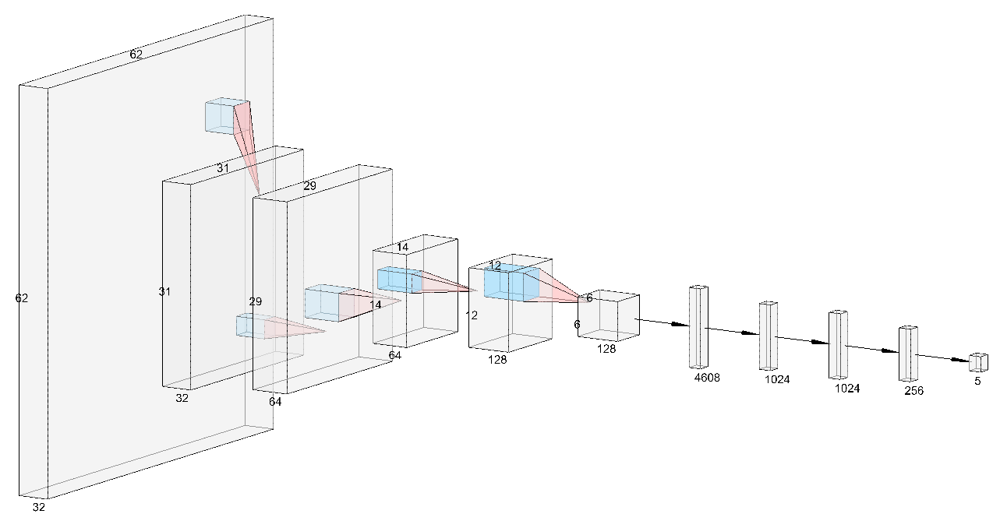
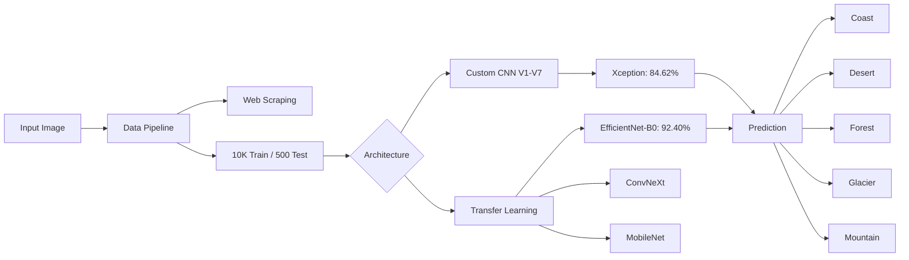

# Terrain Recognition

CNN-based terrain classification from satellite and ground-level imagery, achieving 92.40% test accuracy with EfficientNet-B0 transfer learning across five terrain classes.

<p align="center">
  
</p>

## Overview

Developed for SIH (Smart India Hackathon) under "Deep Learning for Terrain Recognition," this project iterates through seven custom CNN architectures and multiple transfer learning approaches. The model was progressively optimized from 150 MB down to 15.6 MB while improving accuracy, making it deployable on mobile and edge devices.


```mermaid
graph LR
    A[Input Image] --> B[Data Pipeline]
    B --> B1[Web Scraping]
    B --> B2[10K Train / 500 Test]

    B2 --> C{Architecture}
    C --> D[Custom CNN V1-V7]
    C --> E[Transfer Learning]

    D --> D1[Xception: 84.62%]
    E --> E1[EfficientNet-B0: 92.40%]
    E --> E2[ConvNeXt]
    E --> E3[MobileNet]

    D1 & E1 --> F[Prediction]
    F --> G1[Coast]
    F --> G2[Desert]
    F --> G3[Forest]
    F --> G4[Glacier]
    F --> G5[Mountain]
```

## Results

| Model | Test Accuracy | Model Size |
|:--|:--:|:--:|
| **EfficientNet-B0** | **92.40%** | **15.6 MB** |
| Xception | 84.62% | 23 MB |
| Custom CNN V3-V7 | 70-80% | 150 MB |

<p align="center">
  
</p>

## Dataset

- **Source**: Custom-scraped via BeautifulSoup + Selenium
- **Classes**: Coast, Desert, Forest, Glacier, Mountain
- **Split**: 10,000 training / 500 test images

<p align="center">
  
</p>

## Quick Start

```bash
git clone https://github.com/Akasxh/Terrain-Recognition.git
cd Terrain-Recognition
pip install -r requirements.txt

# Best model (EfficientNet-B0)
jupyter notebook transfer_learning/best_recognz_sg.ipynb

# Xception model
jupyter notebook "latest-model /Xception/Xception_V1.ipynb"

# Inference
jupyter notebook call_model.ipynb
```

## Project Structure

```
Terrain-Recognition/
├── Data Main/Training Data/
│   ├── Coast/
│   ├── Desert/
│   ├── Forest/
│   ├── Glacier/
│   └── Mountain/
├── latest-model /Xception/
│   ├── Xception_V1.ipynb
│   ├── model_xception.h5
│   └── confusion_matrix.png
├── transfer_learning/
│   ├── best_recognz_sg.ipynb               # EfficientNet-B0
│   ├── terrain_recognization_sg.ipynb
│   └── transfer_learning_models/
├── Past_Architectures/                      # V1, V2
├── Terrain_V3.ipynb through Terrain_V7.ipynb  # Optimizer experiments
├── call_model.ipynb                         # Inference
├── image/                                   # Diagrams & charts
├── requirements.txt
└── README.md
```

## Tech Stack

- **Frameworks**: TensorFlow/Keras, PyTorch
- **Architectures**: Custom CNN, Xception, EfficientNet-B0, ConvNeXt, MobileNet
- **Data Collection**: BeautifulSoup, Selenium
- **Visualization**: matplotlib, seaborn

## Team -- LearnX

**Lead**: S Akash

<details>
<summary>Contributors</summary>

- Vihaan Agrawal
- Ruchi Chand Thakur
- Manas Gupta
- Tanmay Singh
- Harshith Patnaik

</details>

## License

Licensed under GPL-3.0. See [LICENSE](LICENSE) for details.
